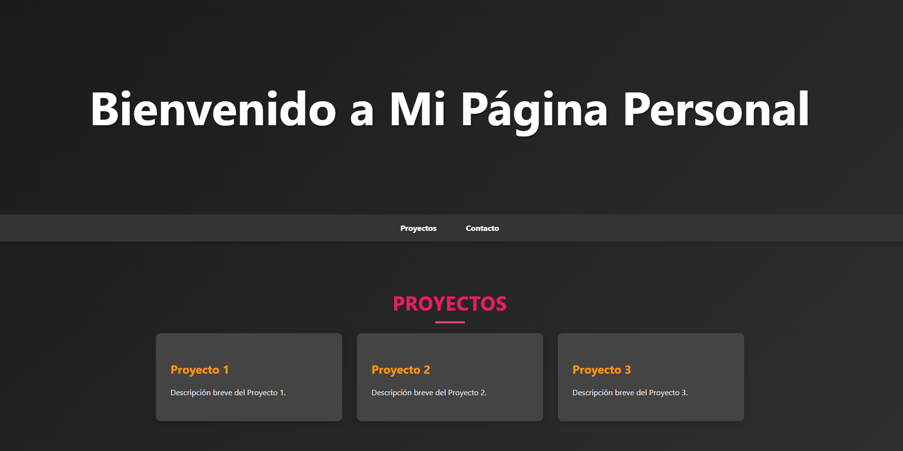

# Mi Página Personal

Este es un proyecto de página web personal simple y elegante que muestra tus proyectos y proporciona una forma de contacto a través de redes sociales.

## Estructura del Proyecto

- **index.html**: Archivo principal HTML.
- **styles.css**: Estilos CSS personalizados para la página.

## Características

- **Sección de Proyectos**: Lista de proyectos con enlaces clicables.
- **Sección de Contacto**: Enlaces a tus redes sociales.
- **Estilo**: Diseño moderno y atractivo con efectos de interacción.

## Captura de Pantalla

